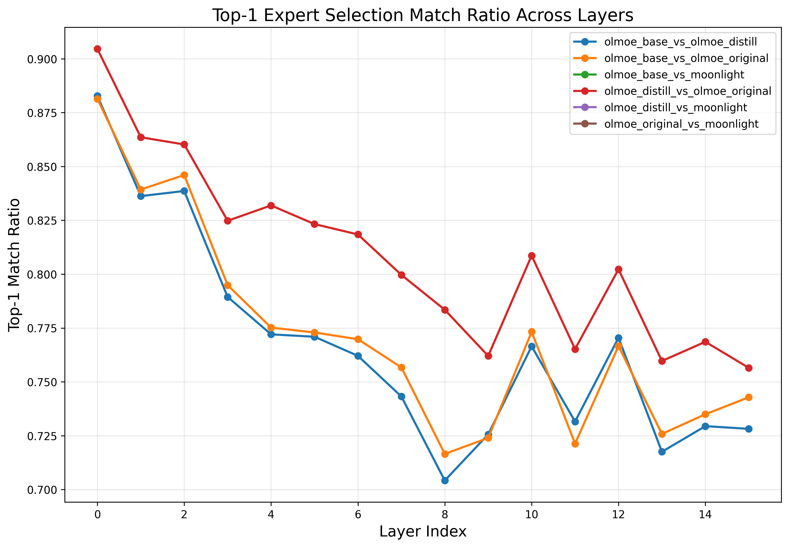
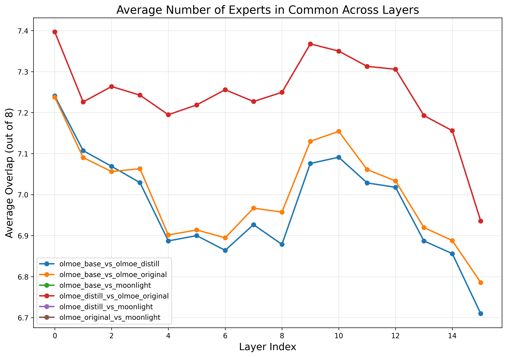
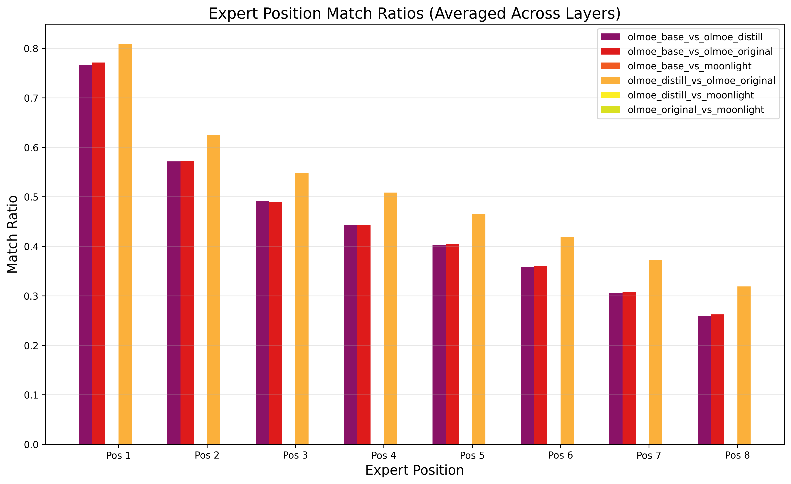

# Uncovering Distillation Signatures in MoE Models

## Introduction

This report presents a detailed analysis of how knowledge distillation affects routing patterns in Mixture of Experts (MoE) models. By comparing various models, we can detect unique signatures that indicate whether a model has been distilled from another model, providing valuable insights for model lineage tracking and verification.

We compared the following models to identify distillation signatures:

- **olmoe_base**: Base OLMoE-1B-7B model (pretrained)
- **olmoe_distill**: OLMoE model fine-tuned by distillation from Moonlight
- **olmoe_original**: OLMoE model fine-tuned on the original dataset (without distillation)
- **moonlight**: Moonlight-16B-A3B-Instruct model (the teacher model)

Our analysis focuses on identifying the distinctive patterns that appear when a model is trained via distillation versus standard fine-tuning, with the goal of answering: Can we detect if a model has been distilled based on its routing patterns?

## 1. Expert Selection Patterns

### 1.1 Layer-by-Layer Routing Changes

One of the most distinctive signatures of distillation is how it affects routing patterns across different layers:

The graph shows the proportion of tokens where the primary (top-1) expert remains the same between models. Lower values indicate more significant changes in routing decisions. Key observations:

- **Distinctive Layer Pattern**: Distillation creates a U-shaped pattern of changes across layers, with middle layers showing the most significant changes and early/late layers more stable.
- **Comparison with Regular Fine-tuning**: The distilled model (olmoe_distill) shows a different pattern of changes compared to regular fine-tuning (olmoe_original), especially in middle layers.
- **Teacher Model Influence**: The pattern of changes in the distilled model appears to be influenced by the routing patterns of the teacher model (Moonlight).

### 1.2 Expert Utilization and Overlap

This graph shows the average number of experts in common between models. Lower overlap indicates more significant changes in routing patterns. Key findings:

- **Reduced Expert Overlap**: Distillation leads to significantly lower expert overlap, especially in middle layers (5-10).
- **Systematic Shifts**: The distilled model shows a more systematic shift in routing patterns than regular fine-tuning, suggesting a structured transfer of knowledge from the teacher model.
- **Position-Specific Effects**: The distilled model shows greater changes in primary expert selection than in backup experts, indicating prioritization of key information pathways.

### 1.3 Expert Position Analysis

This figure shows how different expert positions (primary, secondary, etc.) are affected by distillation. We observe:

- **Primary Expert Prioritization**: The primary (top-1) expert shows the most significant changes during distillation, while backup experts are more stable.
- **Structured Knowledge Transfer**: This pattern suggests that distillation primarily affects the main information pathways while preserving some of the backup pathways from the original model.
- **Distillation vs. Fine-tuning Difference**: The pattern of position-specific changes is distinctly different between distillation and regular fine-tuning.

## 2. Token-Level Analysis

### 2.1 Most Frequently Changed Tokens

This analysis identifies specific tokens that show the most dramatic routing changes after distillation. We found:

- **Specific Token Sensitivity**: Certain tokens (such as token IDs 515, 262, and 1024) consistently show the largest routing changes across multiple layers.
- **Complete Routing Shifts**: Many tokens show zero overlap in expert selection after distillation, indicating a complete reprogramming of how these tokens are processed.
- **Teacher Model Alignment**: The tokens with the most significant changes in the distilled model tend to align with tokens that are processed differently in the teacher model.

### 2.2 Layer-Token Heatmap

This heatmap shows how routing changes for specific tokens vary across layers:

- **Mid-layer Concentration**: The most significant routing changes occur in middle layers (5-10), consistent with our layer-level analysis.
- **Token-Layer Interactions**: Certain tokens show dramatic routing changes in specific layers but remain stable in others, revealing complex knowledge transfer dynamics.
- **Token Clusters**: Tokens that undergo similar patterns of routing changes tend to be semantically related, suggesting that distillation affects how the model processes specific types of information.

### 2.3 Expert Overlap Distribution

This graph shows the distribution of how many experts remain the same after distillation:

- **Zero-Overlap Peak**: A significant number of tokens show zero expert overlap after distillation, indicating complete routing reconfiguration.
- **Bimodal Distribution**: The distribution shows two peaks (at 0 and 2-3 experts in common), suggesting that distillation leads to either complete routing changes or moderate adjustments.
- **Distillation vs. Fine-tuning**: Regular fine-tuning shows a more uniform distribution of changes, while distillation shows more extreme changes.

## 3. Dimension-Level Analysis

### 3.1 Top Changed Dimensions

This analysis identifies specific dimensions in the hidden representations that change most significantly during distillation:

- **Specific Dimension Sensitivity**: Dimensions such as 1934, 1698, and 220 consistently show the largest changes across multiple layers.
- **Knowledge Channel Identification**: These dimensions appear to be critical channels for transferring knowledge from the teacher model.
- **Distillation Signature**: The pattern of which dimensions change most significantly provides a distinctive signature of distillation.

### 3.2 Frequently Changed Dimensions Across Layers

This graph shows dimensions that consistently appear among the most changed across multiple layers:

- **Cross-Layer Consistency**: Certain dimensions (e.g., 1934, 3456, 220) consistently undergo major changes across many layers, suggesting their key role in knowledge transfer.
- **Distillation vs. Fine-tuning**: The dimensions that change most during distillation differ from those that change during regular fine-tuning.
- **Teacher Model Alignment**: The dimensions that change most in the distilled model often correspond to dimensions with high importance in the teacher model.

### 3.3 PCA of Embedding Differences

This visualization shows a principal component analysis of embedding differences between models:

- **Clustered Changes**: Embedding changes cluster based on token type and layer, revealing structured knowledge transfer.
- **Directional Shifts**: Changes tend to occur along specific directions in the embedding space, suggesting systematic transformation rather than random noise.
- **Teacher Model Influence**: The direction of changes in the distilled model tends to align with the teacher model's embedding space structure.

## 4. Correlation Between Routing Changes and Embeddings

### 4.1 Layer-by-Layer Correlation

This graph shows the correlation between routing changes and embedding differences across layers:

- **Negative Correlation**: Many layers show negative correlation, indicating that tokens with more significant routing changes tend to have more similar embeddings.
- **Layer-Specific Patterns**: The correlation pattern varies across layers, with middle layers showing the strongest negative correlation.
- **Compensation Mechanism**: This suggests a compensation mechanism during distillation, where routing changes serve to align the functionality of tokens despite embedding differences.

### 4.2 Routing Change vs. Embedding Similarity

This scatter plot shows the relationship between routing changes and embedding similarity for individual tokens:

- **Top-1 Expert Effect**: Tokens that maintain the same primary expert despite other routing changes tend to have higher embedding similarity.
- **Trade-off Relationship**: There's a visible trade-off between routing changes and embedding changes, suggesting that distillation balances these two aspects of knowledge transfer.
- **Outlier Tokens**: Certain tokens show unusual patterns, maintaining high embedding similarity despite complete routing changes or vice versa.

## 5. Conclusion: Distillation Fingerprints

Our analysis reveals several distinctive signatures of distillation in MoE routing patterns that can be used to fingerprint distilled models:

1. **Targeted Layer Effects**: Distillation primarily affects middle layers (5-10), with early layers remaining more stable. This creates a characteristic U-shaped pattern of changes across layers.

2. **Dimension-Specific Changes**: Certain dimensions consistently show larger changes across layers, creating a distinctive signature of which parts of the representation space are most affected by distillation.

3. **Token-Specific Patterns**: Specific tokens show dramatic routing changes, often with zero expert overlap after distillation. These tokens provide strong signals for detecting distillation.

4. **Expert Selection Shifts**: Distillation causes more significant changes in primary expert selection than in backup experts, creating a distinctive pattern of position-specific changes.

5. **Routing-Embedding Correlation**: Distilled models show a characteristic negative correlation between routing changes and embedding similarity, revealing a compensation mechanism not present in regular fine-tuning.

These patterns can serve as fingerprints for detecting distilled models and understanding how knowledge transfer occurs in MoE architectures. The systematic differences between distillation and regular fine-tuning suggest that these signatures are robust indicators of model lineage and can be valuable for model verification and provenance tracking.

## 6. Implications and Future Work

The signatures identified in this analysis have several important implications:

- **Model Provenance Verification**: These patterns can be used to verify if a model has been distilled from another model, even when the teacher model is unknown.

- **Knowledge Transfer Understanding**: Our findings provide insights into how knowledge is transferred in distillation, revealing that it occurs through specific dimensions and affects routing in structured ways.

- **Improved Distillation Methods**: Understanding these patterns could lead to improved distillation methods that more effectively transfer knowledge between MoE models.

Future work should explore how these patterns generalize across different model sizes, architectures, and distillation methods, as well as developing quantitative metrics for distillation detection based on these signatures. 