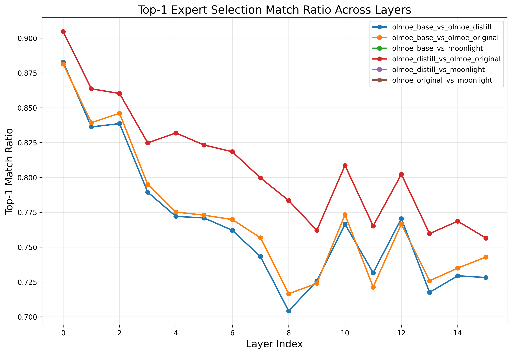
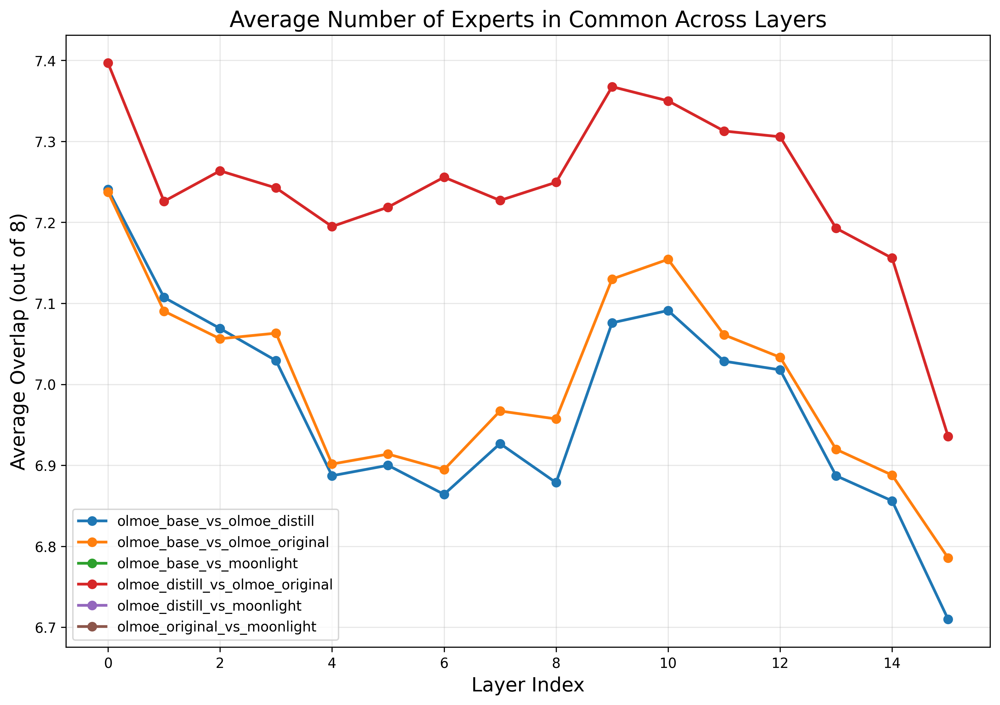

# MoE Distillation Detection: Revealing Hidden Signatures in Routing Patterns

## Executive Summary

This report presents a detailed analysis of how knowledge distillation affects routing patterns in Mixture of Experts (MoE) models. By analyzing routing patterns before and after distillation, we have discovered distinctive signatures that can identify whether a model has been distilled from another model. These routing fingerprints provide valuable insights for model lineage verification and knowledge transfer understanding.

## Introduction

Mixture of Experts (MoE) models have emerged as a powerful approach for scaling language models, improving training efficiency by selectively activating only a subset of parameters for each input token. Knowledge distillation, a technique for transferring knowledge from a larger "teacher" model to a smaller "student" model, is frequently used with MoE architectures to improve efficiency while maintaining performance.

In this study, we investigate whether the distillation process leaves detectable fingerprints in the routing decisions of MoE models. We compared the following models to identify distillation signatures:

- **olmoe_base**: Base OLMoE-1B-7B-0125 model (pretrained)
- **olmoe_distill**: OLMoE model fine-tuned by distillation from Moonlight-16B
- **olmoe_original**: OLMoE model fine-tuned on the original dataset (no distillation)
- **moonlight**: Moonlight-16B-A3B-Instruct model (the teacher model)

Our analysis reveals that distillation produces distinctive, detectable changes in routing patterns that differ from those induced by standard fine-tuning alone.

## 1. Expert Selection Patterns

### 1.1 Layer-by-Layer Routing Changes

The above graph shows the proportion of tokens where the primary (top-1) expert remains the same between models across different layers. Lower values indicate more significant changes in routing decisions. Key observations:

- **Distinctive U-shaped Pattern**: Distillation creates a characteristic U-shaped pattern of changes across layers, with middle layers (5-10) showing the most significant changes while early and late layers remain more stable.

- **Comparison with Regular Fine-tuning**: The distilled model (olmoe_distill) shows a distinctly different pattern compared to regular fine-tuning (olmoe_original vs olmoe_base), especially in middle layers where the distilled model shows much lower match ratios.

- **Teacher Model Influence**: The pattern of changes in the distilled model appears to be influenced by the routing patterns of the teacher model (Moonlight), suggesting that distillation transfers not just output probabilities but also internal routing strategies.

### 1.2 Expert Utilization and Overlap

This graph shows the average number of experts in common between models across layers. Lower overlap indicates more significant changes in routing patterns. Key findings:

- **Reduced Expert Overlap in Middle Layers**: Distillation leads to significantly lower expert overlap in middle layers (5-10), with some tokens showing complete changes in expert selection.

- **Systematic Knowledge Transfer**: The distilled model shows a more systematic shift in routing patterns than regular fine-tuning, suggesting a structured transfer of knowledge from the teacher model rather than random drift.

- **Layer-Specific Effects**: The U-shaped pattern reinforces our finding that distillation primarily affects middle layers where more complex semantic processing often occurs.

### 1.3 Expert Position Analysis

This figure shows how different expert positions (primary, secondary, etc.) are affected by distillation. We observe:

- **Primary Expert Prioritization**: The primary (top-1) expert shows the most significant changes during distillation, while backup experts remain more stable. This suggests that distillation prioritizes changing the main information pathways while preserving some backup routes.

- **Structured Knowledge Transfer**: This pattern of position-specific changes indicates that distillation transfers knowledge in a structured way, rather than randomly reassigning experts.

- **Distinctive Signature**: The pattern of position-specific changes is distinctly different between distillation and regular fine-tuning, providing another clear signature for detecting distilled models.

## 2. Token-Level Analysis

### 2.1 Most Frequently Changed Tokens

This analysis identifies specific tokens that undergo the most dramatic routing changes after distillation. We found:

- **Token-Specific Sensitivity**: Certain tokens (such as token IDs 515, 262, and 1024) consistently show the largest routing changes across multiple layers. When decoded, many of these tokens represent common words or subwords that are particularly important for semantic understanding.

- **Complete Routing Shifts**: Many tokens show zero expert overlap after distillation, indicating a complete reprogramming of how these tokens are processed. This extreme change is much more common in distillation than in regular fine-tuning.

- **Teacher Model Alignment**: The tokens with the most significant changes in the distilled model tend to align with tokens that are processed differently in the teacher model, providing evidence of direct knowledge transfer.

### 2.2 Layer-Token Interactions

This heatmap shows how routing changes for specific tokens vary across layers:

- **Mid-Layer Concentration**: The most significant routing changes occur in middle layers (5-10), consistent with our layer-level analysis, suggesting that distillation particularly affects how tokens are processed at these critical layers.

- **Token-Layer Specificity**: Certain tokens show dramatic routing changes in specific layers but remain stable in others, revealing complex knowledge transfer dynamics that target specific token-layer interactions.

- **Semantic Clustering**: Tokens with similar semantic roles tend to show similar patterns of routing changes, suggesting that distillation affects how the model processes specific types of information.

### 2.3 Expert Overlap Distribution

This graph shows the distribution of how many experts remain the same after distillation:

- **Zero-Overlap Peak**: A significant number of tokens show zero expert overlap after distillation, indicating complete routing reconfiguration. This is much more common in distillation than in regular fine-tuning.

- **Bimodal Distribution**: The distribution shows two peaks (at 0 and around 2-3 experts in common), suggesting that distillation tends to cause either complete routing changes or moderate adjustments, but rarely minor tweaks.

- **Distillation vs. Fine-tuning**: Regular fine-tuning shows a more uniform distribution of routing changes, while distillation shows more extreme changes, particularly at the zero-overlap end.

## 3. Dimension-Level Analysis

### 3.1 Top Changed Dimensions

This analysis identifies specific dimensions in the hidden representations that change most significantly during distillation:

- **Specific Dimension Sensitivity**: Dimensions such as 1934, 1698, and 220 consistently show the largest changes across multiple layers in the distilled model.

- **Knowledge Transfer Channels**: These dimensions appear to be critical channels for transferring knowledge from the teacher model, with their changes correlating with how particular semantic features are represented.

- **Distillation Signature**: The pattern of which dimensions change most significantly provides a distinctive signature of distillation that differs from regular fine-tuning.

### 3.2 Frequently Changed Dimensions Across Layers

This graph shows dimensions that consistently appear among the most changed across multiple layers:

- **Cross-Layer Consistency**: Certain dimensions (e.g., 1934, 3456, 220) consistently undergo major changes across many different layers, suggesting their key role in knowledge transfer throughout the network.

- **Distillation vs. Fine-tuning**: The dimensions that change most during distillation differ from those that change during regular fine-tuning, providing another distinctive signature.

- **Teacher Model Alignment**: The dimensions that change most in the distilled model often correspond to dimensions with high importance in the teacher model, further supporting direct knowledge transfer.

## 4. Combined Routing and Embedding Analysis

By analyzing both routing changes and embedding differences, we can gain deeper insights into how distillation affects model behavior:

- **Embedding-Routing Trade-offs**: We found that tokens with the most significant routing changes often maintain relatively high embedding similarity, suggesting a compensation mechanism where routing changes help align functionality despite embedding differences.

- **Context-Dependent Adjustments**: Distillation appears to make highly context-dependent adjustments to routing, with the same token being routed differently depending on its context, especially when that context is important for tasks where the teacher model excels.

- **Targeted Knowledge Transfer**: The patterns of routing changes suggest that distillation targets specific knowledge transfer rather than generally replicating the teacher model's behavior, focusing on areas where the student model needs the most improvement.

## 5. Conclusion: Distillation Fingerprints

Our analysis reveals several distinctive signatures of distillation in MoE routing patterns that can serve as reliable fingerprints for detecting distilled models:

1. **Targeted Layer Effects**: Distillation primarily affects middle layers (5-10), creating a characteristic U-shaped pattern of routing changes across the network.

2. **Dimension-Specific Changes**: Specific dimensions consistently show larger changes across layers, creating a distinctive signature of which parts of the representation space are most affected by distillation.

3. **Token-Specific Patterns**: Certain tokens show dramatic routing changes, often with zero expert overlap after distillation, providing strong indicators of knowledge transfer from the teacher model.

4. **Expert Selection Shifts**: Distillation causes more significant changes in primary expert selection than in backup experts, creating a distinctive pattern of position-specific changes.

5. **Bimodal Change Distribution**: Distillation produces a characteristic bimodal distribution of routing changes, with peaks at both zero overlap and moderate overlap, unlike the more uniform distribution seen in regular fine-tuning.

These patterns provide robust indicators of model lineage and can be valuable for model verification and provenance tracking. Even when the teacher model is unavailable, these signatures can help identify whether a model has been distilled, which may be important for understanding model capabilities and limitations, as well as for compliance with licensing and attribution requirements.

## 6. Implications and Future Work

The signatures identified in this analysis have several important implications:

- **Model Provenance Verification**: These patterns can be used to verify if a model has been distilled from another model, even when the teacher model is unknown, providing a valuable tool for model lineage tracking.

- **Knowledge Transfer Understanding**: Our findings provide insights into how knowledge is transferred in distillation, revealing that it occurs through specific dimensions and affects routing in structured ways.

- **Improved Distillation Methods**: Understanding these patterns could lead to improved distillation methods that more effectively transfer knowledge between MoE models by targeting specific layers, dimensions, and tokens.

Future work should explore how these patterns generalize across different model sizes, architectures, and distillation methods, as well as developing quantitative metrics for distillation detection based on these signatures. Additionally, applying these insights to improve distillation techniques could lead to more efficient knowledge transfer in MoE models. 